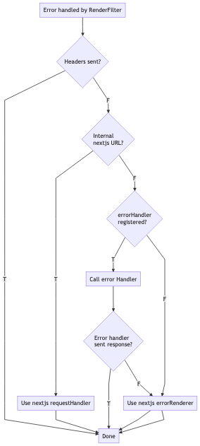

# NestJS NextJS Integration <!-- omit in toc -->

[](https://www.npmjs.com/package/nest-next)

---

<!-- vim-markdown-toc GFM -->

* [Installation](#installation)
* [Usage](#usage)
  * [Import and register the RenderModule](#import-and-register-the-rendermodule)
  * [Default Settings](#default-settings)
  * [Rendering Pages](#rendering-pages)
  * [Handling Errors](#handling-errors)
    * [Custom error handler](#custom-error-handler)
    * [Error Flow (Diagram)](#error-flow-diagram)
* [Examples folder structure](#examples-folder-structure)
  * [Basic Setup](#basic-setup)
  * [Monorepo](#monorepo)
* [Configuring Next](#configuring-next)
* [tsconfig.json](#tsconfigjson)
* [Versioning](#versioning)
* [By Example](#by-example)

<!-- vim-markdown-toc -->

---

## Installation


    yarn add nest-next


## Usage

### Import and register the RenderModule

Import the RenderModule into your application's root module.

```typescript
import { Module } from '@nestjs/common';
import Next from 'next';
import { RenderModule } from 'nest-next';

@Module({
  imports: [
    RenderModule.forRootAsync(Next({ dev: process.env.NODE_ENV !== 'production' })),
    ...
  ],
  ....
})
export class AppModule {}
```

### Settings

Settings to the RenderModule can be passed as the second argument of forRootAsync() above.

```typescript
interface RenderOptions {
  viewsDir: null | string;
  dev: boolean;
}
```

**Views/Pages Folder**

By default the the renderer will serve pages from the `/pages/views` dir. Due to limitations with
Next, the `/pages` dir is not configurable, but the directory within the `/pages` dir is configurable.

The `viewsDir` option determines the folder inside of `pages` to render from. By default the value is `/views` but this can be changed or
set to null to render from the root of `pages`.

**Dev Mode**

By default the dev mode will be set to true unless the NODE_ENV is production. Currently the dev mode determines how the errors should be serialized before being sent to next.

### Rendering Pages

The `RenderModule` overrides the Express/Fastify render. To render a page in your controller import
the Render decorator from `@nestjs/common` and add it to the method that will render the page. The
path for the page is relative to the `/pages` directory.

```typescript
import {
  Controller,
  Get,
  Render,
} from '@nestjs/common';

@Controller()
export class AppController {

  @Get()
  @Render('Index')
  public index() {
    // initial props
    return {
      title: 'Next with Nest',
    };
  }
}
```

Additionally, the render function is made available on the res object.


```typescript
@Controller()
export class AppController {

  @Get()
  public index(@Res() res: RenderableResponse) {
    res.render('Index', {
      title: 'Next with Nest',
    });
  }
}
```

The render function takes in the view, as well as the initial props passed to the page.

```typescript
render = (view: string, initialProps?: any) => any
```

### Handling Errors

By default, errors will be handled and rendered with next's error renderer, which uses the ([customizable](https://nextjs.org/docs/#custom-error-handling)) \_error page. Additionally, errors can be intercepted by setting your own error handler.

#### Custom error handler

A custom error handler can be set to override or enhance the default behavior. This can be used for things such as logging the error or rendering a different response.

In your custom error handler you have the option of just intercepting and inspecting the error, or sending your own response. If a response is sent from the error handler, the request is considered done and the error won't be forwarded to next's error renderer. If a response is not sent in the error handler, after the handler returns the error is forwarded to the error renderer. See the request flow below for visual explanation.

**ErrorHandler Typedef**

```typescript
export type ErrorHandler = (
  err: any,
  req: any,
  res: any,
  pathname: any,
  query: ParsedUrlQuery,
) => Promise<any>;
```

**Setting ErrorHandler**

You can set the error handler by getting the RenderService from nest's container.

```typescript
// in main.ts file after registering the RenderModule

const main() => {
  ...

  // get the RenderService
  const service = server.get(RenderService);

  service.setErrorHandler(async (err, req, res) => {
    // send JSON response
    res.send(err.response);
  });

  ...
}

```

#### Error Flow (Diagram)

_The image is linked to a larger version_

[](./docs/out/error-filter-sequence.png)

## Examples folder structure
### Basic Setup

Next renders pages from the pages directory. The Nest source code can remain in the default `/src` folder

    /src
      /main.ts
      /app.module.ts
      /app.controller.ts
    /pages
      /views
        /Index.jsx
    /components
      ...
    babel.config.js
    next.config.js
    nodemon.json
    tsconfig.json
    tsconfig.server.json


### Monorepo

Next renders pages from the pages directory in the "ui" subproject. The Nest project is in the "server" folder.
In order to make the properties type safe between the "ui" and "server" projects, there is a folder called "dto"
outside of both projects. Changes in it during "dev" runs trigger recompilation of both projects.

    /server
      /src
        /main.ts
        /app.module.ts
        /app.controller.ts
      nodemon.json
      tsconfig.json
      ...
    /ui
      /pages
        /index.tsx
        /about.tsx
      next-env.d.ts
      tsconfig.json
      ...
    /dto
      /src
        /AboutPage.ts
        /IndexPage.ts
      package.json
      

To run this project, the "ui" and "server" project must be built, in any order. The "dto" project will be implicitly built by the "server" project. After both of those builds, the "server" project can be started in either dev or production mode.

It is important that "ui" references to "dto" refer to the TypeScript files (.ts files in the "src" folder), and NOT the declaration files (.d.ts files in the "dist" folder), due to how Next not being compiled in the same fashion as the server.

## Configuring Next

**Required Dependencies**

- `react`
- `react-dom`

## tsconfig.json

Next 9 added [built-in zero-config typescript support](https://nextjs.org/blog/next-9#built-in-zero-config-typescript-support). This change is great in general, but next requires specific settings in the tsconfig which are incompatible with what are needed for the server. However, these settings can easily be overridden in the `tsconfig.server.json` file.

If you are having issues with unexpected tokens, files not emitting when building for production, warnings about `allowJs` and `declaration` not being used together, and other typescript related errors; see the `tsconfig.server.json` [file in the example project](/example/tsconfig.server.json) for the full config.

## Versioning

The major version of `nest-next` corresponds to the major version of `next`.

## By Example

Fully setup projects can be viewed in the [examples folder](/examples)

